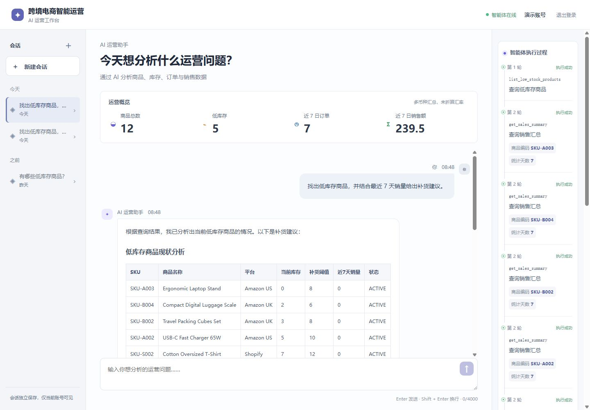
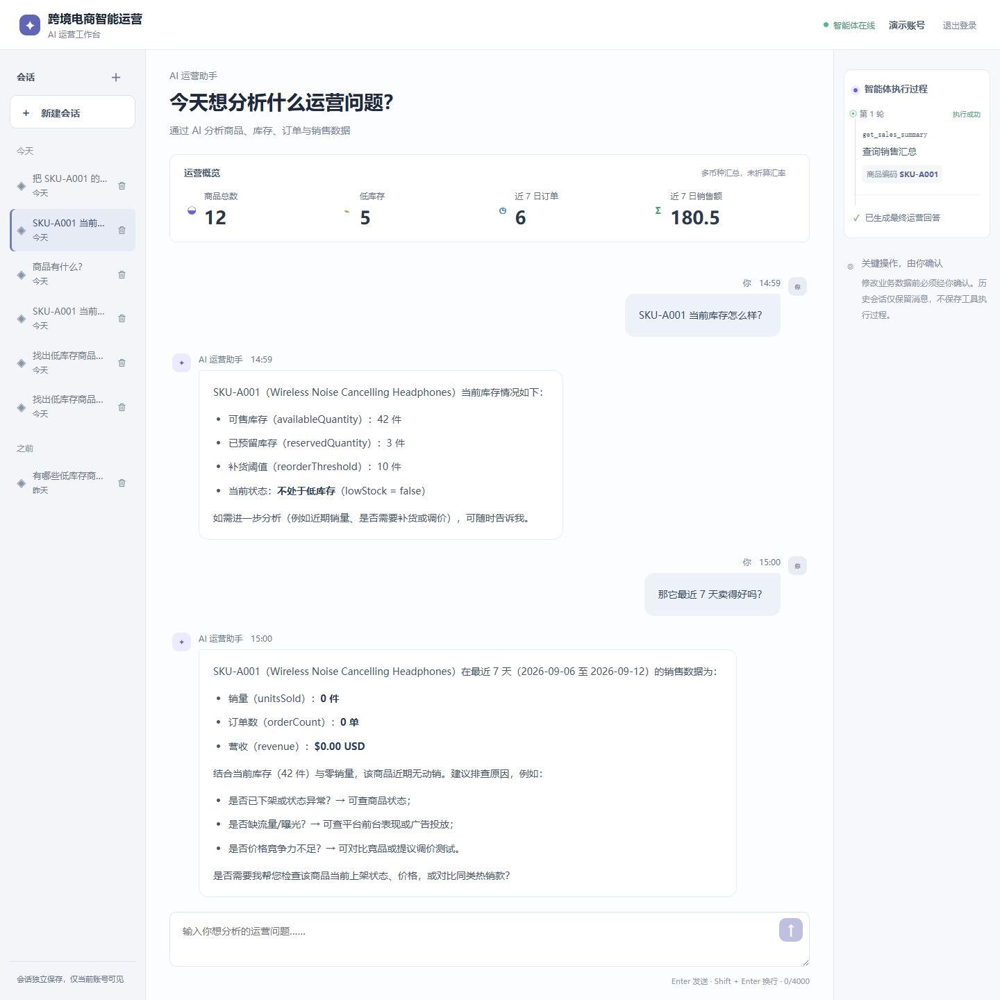
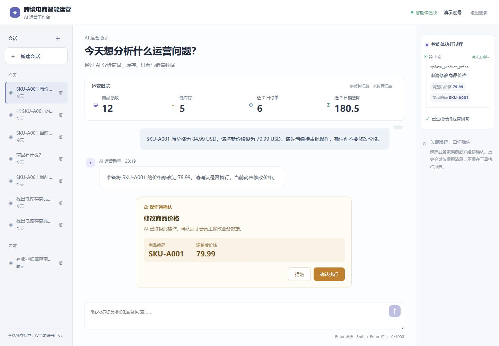

# AI Commerce Ops｜跨境电商智能运营 Agent

基于 Spring Boot、Vue 3 与 Qwen 构建的跨境电商 AI Agent 工作台，面向商品、库存、订单和销售分析场景，支持 Tool Calling、多工具协同分析、多轮会话记忆以及带人工审批与审计的受控写操作。

## 核心功能

- JWT 用户隔离的商品、库存、订单和 Dashboard 数据
- 只读 Tool、qwen-plus Tool Calling、多工具分析和 Conversation Memory
- update_product_price → Pending Action → Human Approval → Audit Log
- 三栏中文运营工作台：会话管理、运营概览、AI 对话、Agent Trace 和审批卡

## 系统架构

User → Vue Operations Workspace → Agent API → Qwen → ToolExecutor → Services → MySQL

写操作：LLM → Write Tool Proposal → Pending Action → Human Approval → ProductService → Audit Log

## 技术栈

- 后端：Java 17、Spring Boot 3、MyBatis-Plus、MySQL 8、Flyway、JWT
- 前端：Vue 3、TypeScript、Vite、Element Plus、Axios、Vue Router；Markdown 使用 marked + DOMPurify 白名单渲染
- 模型：Qwen qwen-plus，通过 DashScope OpenAI Compatible Chat Completions 接入

## 快速开始

1. 复制 .env.example 为本地 .env，设置 MySQL 和 JWT 配置。
2. 在根目录 `.env` 配置 `DASHSCOPE_API_KEY`，不要放入任何 `VITE_*` 变量或提交到 Git。
3. 在根目录运行 `./scripts/dev-start.ps1`：脚本加载 `.env` 到后端进程环境，启动 MySQL 并等待 healthy，再启动后端。
4. 数据库连接密码在 `application.yml` 中按 `DB_PASSWORD` → `MYSQL_PASSWORD` 的优先级读取。通常在 `.env` 配置 `MYSQL_PASSWORD`；确需单独覆盖后端连接时可设置 `DB_PASSWORD`。脚本会把 `.env` 同名项写入进程环境，因此覆盖已有进程变量。已有 MySQL 数据卷不会因环境变量改变而同步账号密码，请使用与库内账号一致的密码，不要删除数据卷。
5. 启动前端：`cd frontend; npm install; npm run dev`。

演示账号：demo@example.com / password。

打开 http://localhost:5173。开发与 preview 使用同源 `/api` 代理到 8080；正式部署需配置相同反向代理及 SPA history fallback。直接 `mvn spring-boot:run` 不会自动读取根目录 `.env`。

主要环境变量：DASHSCOPE_API_KEY、AGENT_MODEL（默认 qwen-plus）、AGENT_MAX_ITERATIONS（默认 6）、AGENT_MAX_HISTORY_MESSAGES（默认 20）、MYSQL_PORT（默认 3307）、JWT_SECRET。

## 核心接口

- POST /api/auth/login
- POST /api/agent/chat
- GET /api/conversations
- GET /api/conversations/{id}/messages
- DELETE /api/conversations/{id}
- GET /api/pending-actions?conversationId={id}&limit=100&offset=0（恢复审批卡片，仅当前用户会话）
- POST /api/pending-actions/{id}/approve
- POST /api/pending-actions/{id}/reject
- GET /api/dashboard/summary
- GET /api/tools

写操作永远先生成 Pending Action，聊天中的确认文字不会执行改价，必须由当前 JWT 用户调用 approve API。

## 测试与验证

    git diff --check
    cd backend
    mvn test
    cd ../frontend
    npm test
    npm run build

最近一次回归与真实验收结果：

- 后端 **74/74**、前端 **12/12**；`npm run build`、`git diff --check` 通过。自动测试使用 Fake 模型，不调用 DashScope。
- Single Tool、Multi-Tool、Conversation Memory、Human Approval + Audit 均已通过真实 Qwen 验证。
- 真实改价闭环：89.99 USD → PENDING（价格不变）→ Approve → 84.99 USD → Audit Log SUCCESS。
- 1440/1280 桌面布局检查通过，真实验收时 Console 无 error/warning。

## 项目截图

> 多工具分析：Agent 调用库存与销售 Tool，结合真实业务数据生成运营建议。

> Conversation Memory：第二轮理解“它”指向上一轮的 SKU-A001，并继续调用销售相关 Tool。

> Human Approval：真实改价提案保持待审批状态，原价格见用户请求，只有确认后才执行改价并写入 Audit Log。

截图来自真实业务数据和 Qwen 调用，Multi-Tool 沿用已通过验收的截图，不使用 Mock 或重放伪造。Trace 不做历史持久化，重新加载页面后不会恢复历史 Tool Trace。

## 项目文档

开发过程与各阶段设计见 [Stage 1](docs/stage1.md)、[Stage 2](docs/stage2.md)、[Stage 3](docs/stage3.md)、[Stage 4](docs/stage4.md)、[Stage 5](docs/stage5.md)、[Stage 6](docs/stage6.md)、[Stage 7](docs/stage7.md)。

## 项目边界

本项目定位为企业业务场景中的 AI Agent，重点展示 Tool Calling、Multi-Tool、Conversation Memory、Human-in-the-loop 和 Audit，不是完整 ERP。

不包含 MCP、Multi-Agent、RAG、向量 Memory、独立 Planning、批量高风险写操作、库存修改、订单退款/取消、复杂权限系统、WebSocket 或 SSE。
